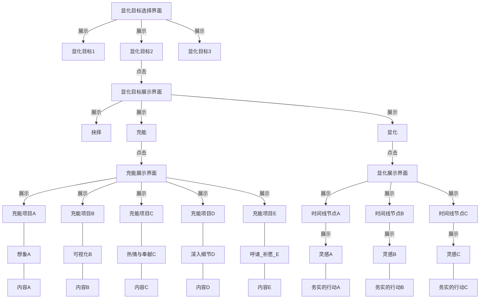
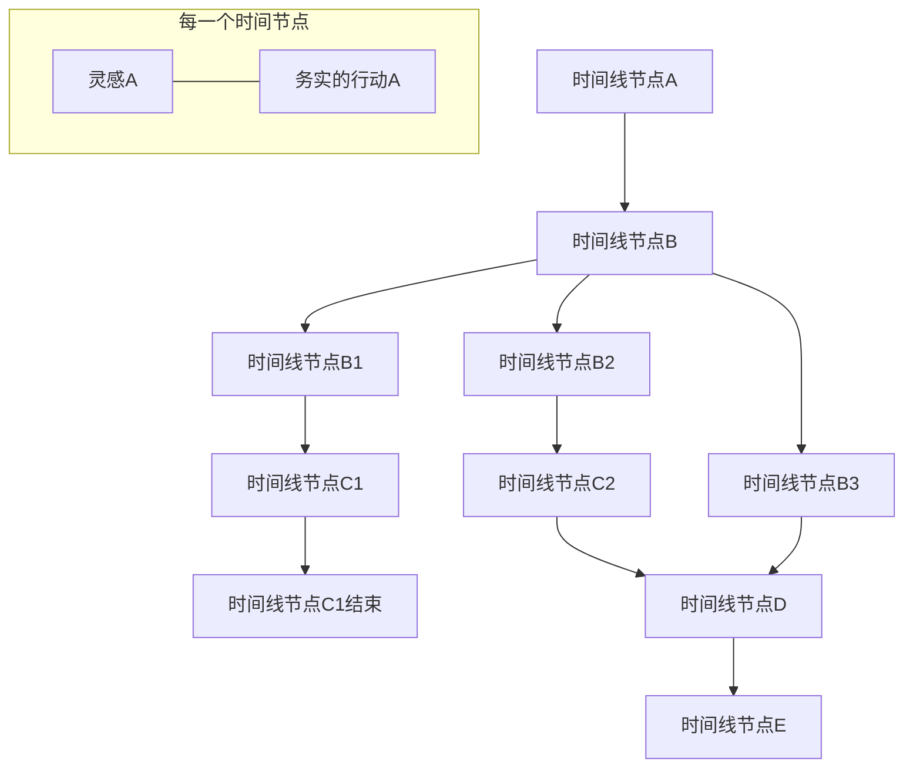
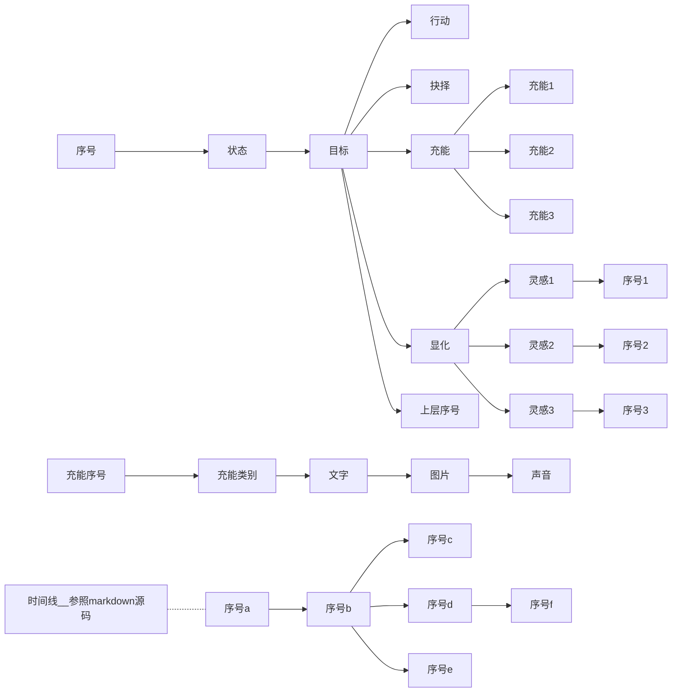

##软件界面

```mermaid
graph TD
显化目标选择界面 -- 展示 --> 显化目标1
显化目标选择界面 -- 展示 --> 显化目标2
显化目标选择界面 -- 展示 --> 显化目标3
显化目标2 -- 点击 --> 显化目标展示界面

显化目标展示界面 -- 展示 --> 抉择
显化目标展示界面 -- 展示 --> 充能
显化目标展示界面 -- 展示 --> 显化

充能 -- 点击 --> 充能展示界面
显化 -- 点击 --> 显化展示界面

充能展示界面 -- 展示 --> 充能项目A
充能展示界面 -- 展示 --> 充能项目B
充能展示界面 -- 展示 --> 充能项目C
充能展示界面 -- 展示 --> 充能项目D
充能展示界面 -- 展示 --> 充能项目E

充能项目A --- 想象A
充能项目B --- 可视化B
充能项目C --- 热情与奉献C
充能项目D --- 深入细节D
充能项目E --- 呼请_祈愿_E

想象A --- 内容A
可视化B --- 内容B
热情与奉献C --- 内容C
深入细节D --- 内容D
呼请_祈愿_E --- 内容E

显化展示界面 -- 展示 --> 时间线节点A
显化展示界面 -- 展示 --> 时间线节点B
显化展示界面 -- 展示 --> 时间线节点C

时间线节点A -- 展示 --> 灵感A
灵感A --- 务实的行动A
时间线节点B -- 展示 --> 灵感B
灵感B --- 务实的行动B
时间线节点C -- 展示 --> 灵感C
灵感C --- 务实的行动C
```

##时间线

```mermaid
graph TD

subgraph 每一个时间节点
灵感A --- 务实的行动A
end
时间线节点A --> 时间线节点B
时间线节点B --> 时间线节点B1
时间线节点B --> 时间线节点B2
时间线节点B --> 时间线节点B3
时间线节点B1 --> 时间线节点C1
时间线节点B2 --> 时间线节点C2
时间线节点C1 --> 时间线节点C1结束

时间线节点C2 --> 时间线节点D
时间线节点B3 --> 时间线节点D
时间线节点D --> 时间线节点E
```

## 数据结构

```mermaid
graph LR

序号 --> 状态
状态 --> 目标
目标 --> 行动
目标 --> 抉择
目标 --> 充能
充能 --> 充能1
充能 --> 充能2
充能 --> 充能3
目标 --> 显化
显化 --> 灵感1
显化 --> 灵感2
显化 --> 灵感3
灵感1 --> 序号1
灵感2 --> 序号2
灵感3 --> 序号3
目标 --> 上层序号

充能序号 --> 充能类别 
充能类别 --> 文字
文字 --> 图片
图片 --> 声音

时间线__参照markdown源码 -.- 序号a
序号a --> 序号b
序号b --> 序号c
序号b --> 序号d
序号b --> 序号e
序号d --> 序号f

```